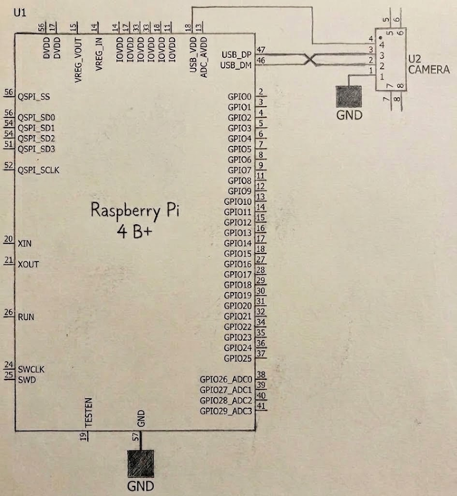
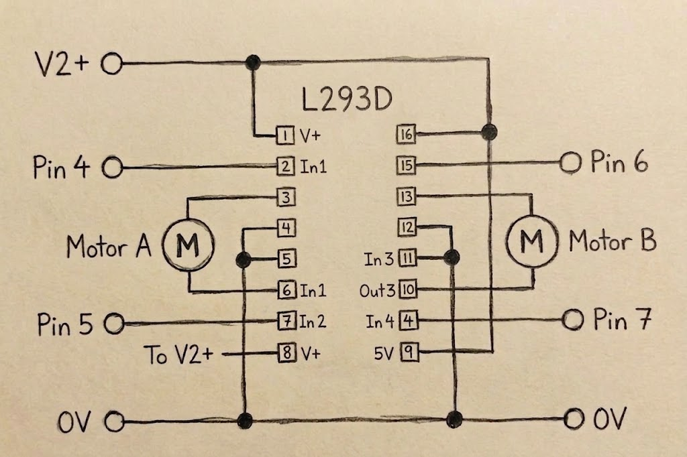
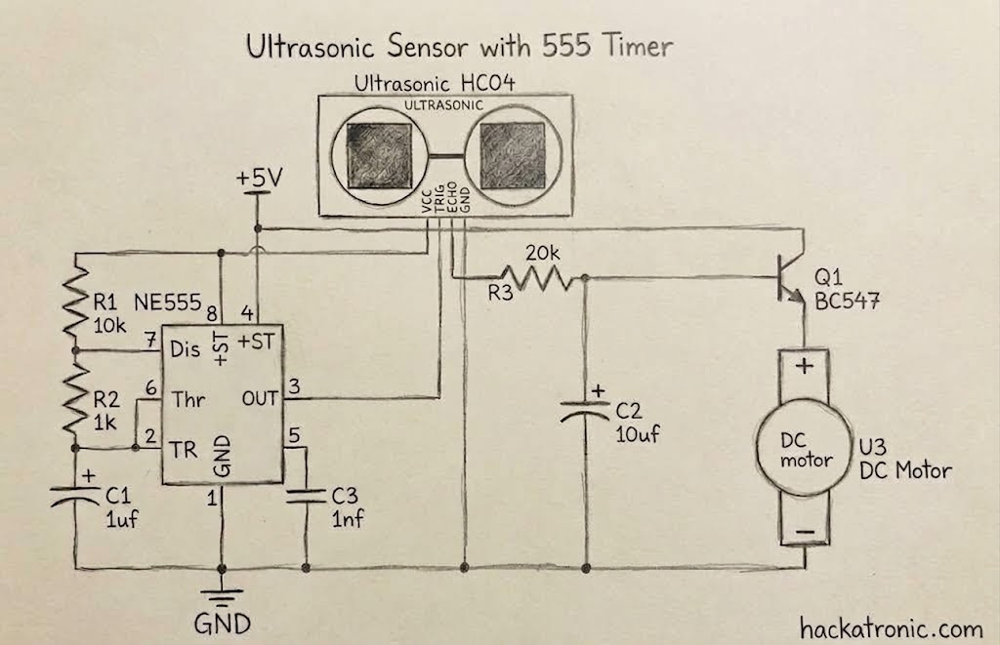
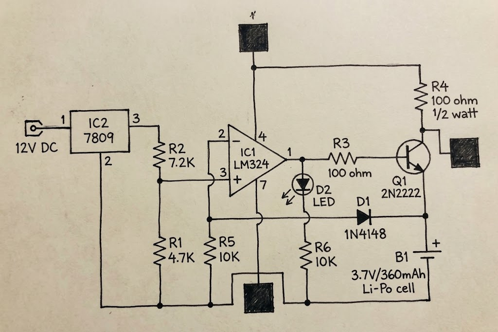
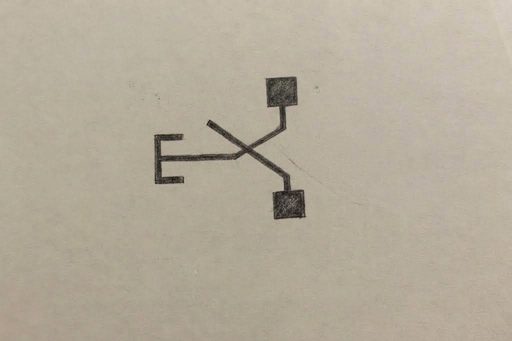
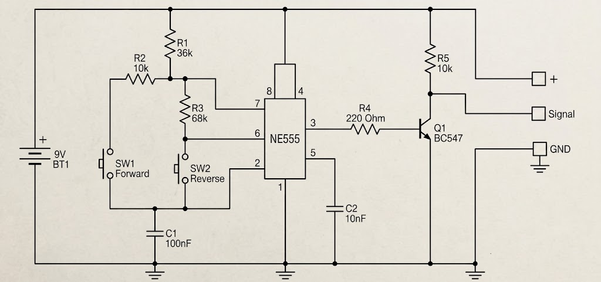

[# ⚡ Schemes & Hardware Documentation

This folder contains the complete electrical schematics, wiring diagrams, power management documentation, and datasheet references for our WRO Future Engineers autonomous vehicle. The electrical system has been engineered to ensure optimal power distribution, minimal latency, and robust hardware integration.

---

## 🎯 Electrical Design Philosophy

Our system employs a modular dual-processing architecture to balance high-level computer vision with real-time hardware control:
* **High-Level Processing**: A **Raspberry Pi 4 Model B** handles camera feedback, lane detection, sign recognition, and path planning algorithms.
* **Low-Level Control & Sensor Fusion**: An **ESP32 (ESP-WROOM-32)** is dedicated to low-latency real-time task management, precision ultrasonic timing, and motor PWM drive output.

---

## 📋 Complete Bill of Materials (BOM)

| Component | Image | Datasheet Reference | Type | Primary Function |
|-----------|-------|--------------------|------|------------------|
| **Raspberry Pi 4 Model B** |  | `raspberry-pi-4-datasheet.pdf` | Single-Board Computer | Vision processing and high-level autonomous navigation |
| **ESP32 (ESP-WROOM-32)** |  | `ESP-WROOM-32.PDF` | Microcontroller | Real-time sensor reading, timing, and actuator drive logic |
| **Raspberry Pi Camera v2** |  | `RASPBERRY PI CAMERA V2 DATASHEET .PDF` | Vision Sensor | 8MP camera input for track boundary and sign detection |
| **HC-SR04** | *N/A* | `HC-SR04.PDF` | Distance Sensor | Ultrasonic range detection for obstacle avoidance |
| **DC Motor Driver** | *N/A* | `Motor Driver Data Sheet.pdf` | Motor Driver | H-bridge PWM control for drive motor speed/direction |
| **DC Motor** |  | `Motor_Data_Sheet.pdf` | Propulsion Actuator | Main drive propulsion motor |
| **Steering Servo (Mg966R)** |  | *Standard Specs* | Steering Actuator | Ackermann steering mechanism control |
| **Buck Converters** |  | *Standard Specs* | Power Management | Step-down voltage regulation (e.g., 12V to 5V) |
| **Batteries** |  | *Standard Specs* | Power Source | Main vehicle power supply |

---

## 🔌 Complete Wiring System & Schematics

### Master Wiring Schematic & Physical Implementation

  <em>1) Complete system wiring schematic showing all electrical connections • 2) Physical implementation of the electronics board</em>

### Component-Specific Schematics

  
  

  <em>1) Raspberry Pi 4 to ESP32 UART/I2C Communication & Logic Level Wiring • 2) Motor Driver and DC Motor Control Scheme</em>

  
  

  <em>3) HC-SR04 Ultrasonic Sensors & Camera Wiring • 4) Power Step-Down and Battery Distribution Architecture</em>

---

## 🎮 Interface & Control Systems

  
  

  <em>1) Tactile start button with direct connection to microcontroller • 2) Logic level converter implementation for signal safety</em>

**User Interface**:
- **Start Mechanism**: Tactile switch with direct pin-to-GND connection.
- **Visual Feedback**: Software includes LED visual feedback and hardware/software debounce logic.
- **Safety**: Momentary action design helps prevent accidental operation. The switch is active low, meaning it triggers the autonomous sequence when pressed, ensuring that operation only occurs during intentional activation.

**Signal Conditioning**:
- **Voltage Compatibility**: Logic level conversion ensures reliable 3.3V (ESP32/RPi) to 5V signal conversion for stable steering servo motor control.
- **Noise Immunity**: Proper decoupling capacitors and signal integrity maintenance prevent erratic servo jitters.
- **Control Signal Support**: Facilitates effective control of the actuators by ensuring proper voltage levels across the different logic domains.

### DC Motor Drive System
- **Motor Specification**: **JGA25-370** geared DC motor for robust propulsion.
- **Power Architecture**: The motor driver receives raw battery voltage directly to minimize power losses and maximize torque, isolating the motor current from the logic boards.
- **Logic Level**: Operates smoothly with 3.3V PWM control signals outputted by the ESP32.
- **Speed Calculation**: 
  - Base Motor RPM: 45rpm
  - Gear Ratio: 1:1
  - Wheel Diameter: 65mm
  - Theoretical Maximum Speed: 1.55 m/s
  - Operational Speed: Regulated via ESP32 PWM control for optimal turning stability and precise braking.

---

## 🛠️ Engineering Challenges & Solutions

### 1. Ultrasonic Sensor Beam Angle (Field of View) Challenge

**Problem Identification**:
- **Ground Intersection**: At medium ranges, the 15° acoustic beam angle cone of the HC-SR04 sensors intersects with the ground surface, causing false positive obstacle detections.
- **Robot Constraints**: The minimal height of our vehicle's chassis forces low sensor mounting, exacerbating the ground reflection issue.

**Engineering Solutions**:
1. **Angular Adjustment**: Sensors are mounted with a slight upward tilt (approx. 3-5 degrees) to increase the ground intersection distance beyond our braking threshold.
2. **Acoustic Dampening**: Using vibration-dampening mounts to prevent motor vibrations from causing mechanical echoes.
3. **Threshold Optimization (Software)**: The ESP32 utilizes a median filter and software distance thresholds to reliably detect real objects and ignore sudden ground interference spikes.

**Result**: Extended usable and clean detection range without compromising the low center of gravity of the vehicle.

### 2. Space & Board Optimization Strategy

To fit the dual-processor architecture and power management systems onto a compact chassis, we optimized our hardware footprint through structured layout planning:
- **Layered Arrangement**: Components are organized in structured vertical layers to segregate high-power lines from sensitive logic boards.
- **Structural Integrity**: Strategic component placement (stacking logic boards securely) maintains board rigidity and saves horizontal space.
- **Accessibility**: All test points, USB ports, and power terminals remain easily accessible for quick programming and battery maintenance.

---

## ⚡ Power Management System

### Power Distribution Architecture

Our vehicle relies on a multi-rail power distribution network to isolate noisy inductive loads (motors) from sensitive digital logic (microcontrollers):
* **Main Battery Rail**: Direct power to the Motor Driver for maximum propulsion efficiency.
* **+5V Regulated Rail (Buck Converter)**: Dedicated clean power for the Raspberry Pi 4 and the steering servo.
* **+3.3V Logic Rail**: Powered via internal regulators for the Camera v2, ESP32, and logic signals.

### Power Consumption Analysis

To guarantee battery reliability and prevent brownouts during competition, we calculated the typical and peak power draw of our system:

| Component | Operating Voltage | Typical Current | Peak Current (Stall) | Power Consumption (Typical - Peak) |
|-----------|-------------------|-----------------|----------------------|------------------------------------|
| **Raspberry Pi 4 Model B** | 5.0V | 600 mA | 1500 mA | 3.0 W - 7.5 W |
| **ESP32 (ESP-WROOM-32)** | 3.3V | 50 mA | 240 mA | 165 mW - 792 mW |
| **Raspberry Pi Camera v2** | 3.3V | 200 mA | 250 mA | 660 mW - 825 mW |
| **HC-SR04 Sensors (x2)** | 5.0V | 30 mA | 40 mA | 150 mW - 200 mW |
| **Mg966R Steering Servo** | 5.0V | ~300 mA | 1200 mA | 1.5 W - 6.0 W |
| **Motor Driver + DC Motor** | 7.4V - 12.0V| ~400 mA | ~1500 mA | 3.0 W - 18.0 W |
| **Total System Load** | **Mixed** | **~ 1.5 A** | **~ 4.7 A** | **~ 8.5 W - 33.3 W** |

**Operational Power Validation:**
* **Typical Operation:** The robot draws around 8.5W to 12W during normal track navigation.
* **Peak Operation:** System can safely handle surges up to ~33W during heavy cornering and processing.

---

## 📚 Local Datasheet References

All critical component specs and electrical ratings are archived locally in this repository for verification and offline access:

| Component Name | File | Key Specifications Covered |
|----------------|------|----------------------------|
| **Raspberry Pi 4** | [`raspberry-pi-4-datasheet.pdf`](raspberry-pi-4-datasheet.pdf) | Broadcom BCM2711, GPIO layout, power specs |
| **ESP-WROOM-32** | [`ESP-WROOM-32.PDF`](ESP-WROOM-32.PDF) | Dual-core Tensilica LX6, pinout, power modes |
| **RPi Camera v2** | [`RASPBERRY PI CAMERA V2 DATASHEET .PDF`](RASPBERRY%20PI%20CAMERA%20V2%20DATASHEET%20.PDF) | Sony IMX219 8MP sensor, CSI interface timing |
| **HC-SR04** | [`HC-SR04.PDF`](HC-SR04.PDF) | Trigger/Echo pulse specifications, measurement ranges |
| **Motor Driver** | [`Motor Driver Data Sheet.pdf`](Motor%20Driver%20Data%20Sheet.pdf) | H-Bridge logic truth table, peak current limits |
| **DC Motor** | [`Motor_Data_Sheet.pdf`](Motor_Data_Sheet.pdf) | Operating voltage, RPM, torque specifications |

---

## ✅ Engineering Validation

This comprehensive electrical and schematic documentation provides complete transparency into our design process, component selection rationale, manufacturing methodology, and problem-solving approaches. Every aspect of our electrical system has been optimized for reliability, maintainability, and performance in the WRO 2026 Future Engineers competition.

**Documentation Completeness**: All schematics, wiring diagrams, component specifications, and implementation details are provided to enable exact replication of our electrical systems. This documentation aims to fulfill the WRO Future Engineers competition requirements for comprehensive engineering documentation through detailed electrical system transparency.
]
